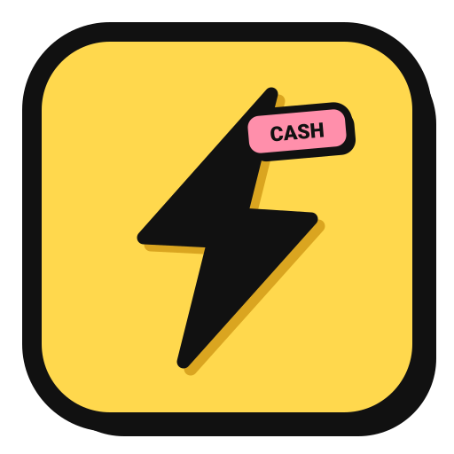

<div align="center">

  

  <h1>⚡ BRUTAL CASH</h1>

  <p>
    <b>A Fast, Mobile-First, Offline-First Expense Tracker & Balance Manager with a Playful Neo-Brutalist UI.</b>
  </p>

  <p>
    <a href="https://11ariz.github.io/brutal-cash/"></a>
    <a href="https://github.com/11Ariz/brutal-cash/actions/workflows/deploy.yml"></a>
    <a href="https://nextjs.org/"></a>
    <a href="https://www.typescriptlang.org/"></a>
    <a href="https://tailwindcss.com/"></a>
    <a href="https://dexie.org/"></a>
    <a href="LICENSE"></a>
  </p>

  <p>
    <a href="#-quick-tour--mockup">Quick Tour</a> •
    <a href="#-core-philosophy">Philosophy</a> •
    <a href="#-key-features">Key Features</a> •
    <a href="#-tech-stack">Tech Stack</a> •
    <a href="#-getting-started">Getting Started</a> •
    <a href="#-installing-on-mobile-pwa">Install PWA</a> •
    <a href="#-license">License</a>
  </p>

</div>

---

## 📱 Quick Tour & Mockup

```text
┌────────────────────────────────────────────────────────┐
│                      BRUTAL CASH                       │
├────────────────────────────────────────────────────────┤
│  ⚡ TOTAL BALANCE                                       │
│     ₹18,450                                            │
│     💵 Cash: ₹4,000         📱 UPI: ₹14,450            │
│     [+ Add Money]           [- Add Expense]            │
├────────────────────────────────────────────────────────┤
│  📊 SPENDING OVERVIEW                                  │
│     Today: ₹250    |   Week: ₹2,400   |  Month: ₹12,500│
├────────────────────────────────────────────────────────┤
│  📈 AVERAGE DAILY SPEND                                │
│     ₹385 / day  (Total Expenses ÷ Active Days)         │
│     Since first money added on Sep 15                  │
├────────────────────────────────────────────────────────┤
│  🏷️ CATEGORY-WISE SPENDS                               │
│     🍔 Food & Drinks   ₹1,850 (42%) [████████░░░░]     │
│     🚗 Travel & Fuel     ₹750 (17%) [████░░░░░░░░]     │
│     [All Time]  [This Month]                           │
├────────────────────────────────────────────────────────┤
│  🔥 NO-SPEND STREAK             ⚡ SMART INSIGHT RADAR  │
│     4 Day Streak               You usually spend ₹350  │
│     (Tracked strictly from      Today you spent ₹1,500 │
│      first deposit date)        ⚠️ High spend spike!   │
├────────────────────────────────────────────────────────┤
│  📜 RECENT TRANSACTIONS (Latest 5 items)               │
│     ☕ Espresso              -₹150  (Cash)             │
│     🛒 Supermarket          -₹1,240 (UPI)              │
│     [View All in History →]                            │
└────────────────────────────────────────────────────────┘
│ [🏠 Home]   [📜 History]   ( ➕ FAB )   [📅 Calendar]  [⚙️ Settings] │
└────────────────────────────────────────────────────────┘
```

---

## 💡 Core Philosophy

Traditional budget apps force you into rigid categories, tedious monthly allowances, and constant guilt trips. **BRUTAL CASH** is built on a direct, balance-first model:

$$\text{Current Balance} = \text{Total Money Added} - \text{Total Expenses}$$

### The < 3 Taps Flow:
1. **Open app**
2. **Tap Add** (or use quick-amount chips)
3. **See updated balance instantly**

No login required, no slow network loading spinners, and complete local privacy.

---

## ✨ Key Features

### ⚡ 1. Dynamic Dual-Account Balances (Cash & UPI)
- Keeps track of both **💵 Physical Cash** and **📱 Digital UPI** balances simultaneously.
- **1-Tap Transfer Modal**: Seamlessly transfer money between Cash and UPI (e.g. ATM cash withdrawals or UPI cash deposits) to keep physical and digital balances synchronized.

### 📈 2. Average Daily Burn (Since Money Was Added)
- Calculates your real daily burn rate: `Total Expenses ÷ Days Active Since First Money Added`.
- Unlike generic budget limits, this tracks how your money is *actually* pacing based on the timeline since your funds were deposited.

### 🏷️ 3. Real-Time Category-Wise Spending
- Direct on-dashboard category breakdown showing exact amounts and percentage progress bars.
- Instant switch between **"All Time"** and **"This Month"** views.
- Customizable categories with rich emoji icons and signature neo-brutalist pastel colors.

### 🔥 4. Strict No-Spend Day Streaks
- Tracks zero-expense days **strictly starting from the day money was first added** (excluding irrelevant prior dates).
- Tap the streak card to launch an interactive **Confetti Firework celebration**!
- Shows active current streak and all-time best streak.

### 📜 5. High-Speed Paginated Transaction Log (`/history`)
- **Smart Chunk Loading**: Loads transactions 10 at a time with an interactive `⚡ Load 10 More` button.
- **Instant Search**: Fuzzy search by Title, Category, or Notes.
- **Multi-Filter Chips**: Filter on-the-fly by Type (*Expense / Income*), Account (*Cash / UPI*), Category, or Date Range (*Today, This Week, This Month, Custom*).
- Shows live counter: `Showing 10 of 45 entries (filtered from 50)`.

### 📅 6. Interactive Spending Calendar (`/calendar`)
- Monthly visual overview with day-by-day burn radar and No-Spend `🔥` badges.
- Only displays flames on eligible days on or after your initial deposit.
- **Day Inspection Sheet**: Tap any past date to view full transaction records or backdate an entry with `+ Add For This Day`.

### 📊 7. Analytics & Trend Radar (`/analytics`)
- Interactive SVG burn curves with **7-day**, **30-day**, and **90-day** time horizons.
- Cash vs UPI payment distribution pie breakdown.
- Anomaly detector that flags unexpected spending spikes compared to your rolling average.

### 📴 8. 100% Offline-First Privacy (Dexie.js / IndexedDB)
- All records are saved in your browser’s IndexedDB via **Dexie.js**.
- Sub-millisecond read/write speeds with zero latency.
- Completely functional without internet or cell service.

### ☁️ 9. Optional Supabase Cloud Sync
- Bring your own database! Easily configure Supabase URL & Key in Settings to enable cross-device backup and synchronization.

### 💾 10. Data Freedom & Portability
- **Export to CSV**: Formatted with UTF-8 BOM for flawless rendering in Microsoft Excel, Google Sheets, and Apple Numbers.
- **Export to JSON**: Full database dump for total peace of mind.
- **Restore Backup**: Instant 1-click JSON import to restore all transactions and categories.
- **Sample Data**: Built-in 1-click demo data generator to explore the UI immediately.

### 🔊 11. Tactile Neo-Brutalist Audio & Haptics
- Synthesized Web Audio API sound effects (crisp pops, thuds, and cash register chimes).
- Mobile tactile vibration feedback on supported devices.
- Fully toggleable in Settings.

---

## 🛠️ Tech Stack

| Layer | Technology | Description |
| :--- | :--- | :--- |
| **Framework** | [Next.js 16 (Turbopack)](https://nextjs.org/) | App Router, static generation, React 19 |
| **Language** | [TypeScript 5](https://www.typescriptlang.org/) | Strict type safety and complete interfaces |
| **Styling** | [Tailwind CSS 4](https://tailwindcss.com/) | Neo-brutalist utility system with custom tokens |
| **Local Storage** | [Dexie.js (IndexedDB)](https://dexie.org/) | Offline-first, high-performance client database |
| **Icons** | [Lucide React](https://lucide.dev/) | Crisp, modern minimalist iconography |
| **Visual Effects**| [Canvas Confetti](https://www.npmjs.com/package/canvas-confetti) | High-performance canvas-based celebratory effects |
| **Audio Engine** | Web Audio API | Custom oscillator synthesizer with zero external audio assets |
| **Deployment** | [GitHub Pages + Actions](https://pages.github.com/) | Automated CI/CD static workflow with SPA fallback |

---

## 🎨 Neo-Brutalist Design Tokens

| Token | Hex | Usage |
| :--- | :--- | :--- |
| **Cream Canvas** | `#FFF9E8` | Warm vintage paper background |
| **Ink Black** | `#111111` | 3px / 4px solid borders & dominant typography |
| **Canary Yellow** | `#FFD84D` | Hero cards, primary CTA buttons & active pills |
| **Mint Green** | `#7BF1A8` | Income badges, positive balance, streak indicator |
| **Bubblegum Pink** | `#FF8FAB` | Expense badges, delete confirmations |
| **Sky Blue** | `#80BFFF` | UPI tags, transfer cards, secondary accents |
| **Coral Red** | `#FF6B6B` | Critical alerts, zero-balance warnings |

---

## 🚀 Getting Started

### Prerequisites
- **Node.js**: `v20.x` or `v22.x` (or newer)
- **npm**, **pnpm**, or **yarn**

### Installation

```bash
# 1. Clone the repository
git clone https://github.com/11Ariz/brutal-cash.git

# 2. Navigate to project directory
cd brutal-cash

# 3. Install dependencies
npm install

# 4. Start the local development server
npm run dev
```

Open [http://localhost:3000](http://localhost:3000) in your browser to start tracking!

### Building for Production / Static Export

```bash
npm run build
```
Static production output will be generated in `./out`, ready for deployment to any static host (GitHub Pages, Vercel, Cloudflare Pages, Netlify).

---

## 📱 Installing on Mobile (PWA)

**BRUTAL CASH** is designed as a standalone Progressive Web App (PWA). You can install it on your mobile home screen with full offline support:

### iOS (iPhone & iPad)
1. Open [https://11ariz.github.io/brutal-cash/](https://11ariz.github.io/brutal-cash/) in **Safari**.
2. Tap the **Share** button (the square with an arrow pointing up).
3. Scroll down and tap **"Add to Home Screen"**.
4. Tap **Add** in the top right corner.

### Android (Chrome)
1. Open [https://11ariz.github.io/brutal-cash/](https://11ariz.github.io/brutal-cash/) in **Chrome**.
2. Tap the in-app **"⚡ Install App"** banner at the top, or tap the three dots **(⋮)** in the browser bar.
3. Select **"Install app"** or **"Add to Home screen"**.

---

## 📂 Project Structure

```text
brutal-cash/
├── .github/
│   └── workflows/
│       └── deploy.yml          # GitHub Actions deploy to GitHub Pages
├── public/
│   ├── icons/                  # PWA icons (SVG & PNG)
│   ├── manifest.json           # Web App Manifest
│   └── sw.js                   # Offline caching Service Worker
├── src/
│   ├── app/
│   │   ├── analytics/          # Trend analytics & spend breakdown
│   │   ├── calendar/           # Spending heatmap & day inspection
│   │   ├── history/            # Paginated transaction log & filters
│   │   ├── settings/           # Export/import, sync & preferences
│   │   ├── layout.tsx          # PWA shell, nav header & bottom navigation
│   │   └── page.tsx            # Main dashboard & quick metrics
│   ├── components/
│   │   ├── AddTransactionModal.tsx  # < 3 taps transaction logger
│   │   ├── TransferModal.tsx        # Cash ↔ UPI fund transfer
│   │   ├── DayDetailsModal.tsx      # Calendar day inspector & backdating
│   │   └── InstallPwaPrompt.tsx     # Smart install banner
│   ├── context/
│   │   └── ExpenseContext.tsx  # Global state, Dexie sync, audio & mutations
│   ├── lib/
│   │   ├── calculations.ts     # Balance, streak, average burn & anomaly algorithms
│   │   ├── constants.ts        # Default categories & initial sample data
│   │   ├── db.ts               # Dexie IndexedDB schema & versioning
│   │   ├── sound.ts            # Web Audio API synthesizer & mobile haptics
│   │   └── sync.ts             # Supabase cloud sync integration
│   └── types/
│       └── index.ts            # TypeScript interfaces & data models
├── next.config.ts              # Next.js configuration (basePath, static export)
├── package.json
└── README.md
```

---

## 📄 License

Distributed under the **MIT License**. See [`LICENSE`](LICENSE) for more information.

---

<div align="center">
  <sub>Built with ⚡, black ink, and bold borders by <a href="https://github.com/11Ariz">Ariz</a>.</sub>
</div>
